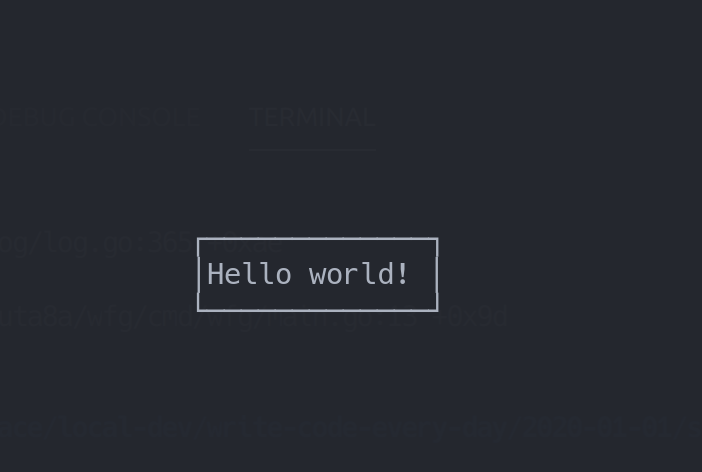

# 2020-01-01
- webview from go(wfg)というlynxみたいなやつでVim操作ができるものをgoでなら書けるのではと考えていた。
- どっちかというと(ReadOnlyな)エディタが操作画面の参考になりそうなので、viとか使えないかなと思って調べていたら https://qiita.com/iigura/items/678aca225956272bdc10 を見つけた。これをgoで実装したい。

# vi like editor
- screen initを実装して無を表示したい。
  - initscr cursesの関数
- cursesはターミナルを扱うもの
  - https://qiita.com/hrdrq/items/f72cb770d5f9e9a2840c
  - pythonで独自GUIを作っている
- gocuiを使ってみる。

- https://gist.github.com/jroimartin/1ac98d3da7278fa18866c9cae0af6007
  - ズバリgocuiを使ってeditorを作るやつがあった(動いた)

# まとめ
- vi風エディタは作れる
- NEXT: vi風の動きで、markdownをレンダリングしてその上でカーソルを動かす
