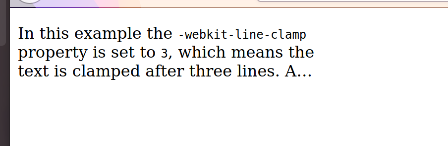
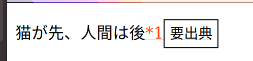

# 2021-01-05
- https://developer.mozilla.org/ja/docs/Web/CSS/Reference
- 今日から「CSSのプロパティ全部試す」をちまちま進めていくことにする
- .とAをやろう

# .
- `-webkit-line-clamp`
  - `line-clamp`を使ったほうがいいみたい。
  - 行数制限ができて、残りは`...`表示される
  - firefoxで確認

# A
- `:active`
  - `a`, `button`に使うことが多い。
  - LVHA order (:link, :visited, :hover, :active)の順に強い。linkが一番強いので、上書きされてしまう
  - だから、最後にactive規則を書くようにする。
- `additive-symbols`
  - firefoxのみサポートなので飛ばす
  - カウンターみたいな加算的なときに、それに対応するsymbolを独自に定義できる
- `::after`
  - after, yui540さんのCSS講座(今なくなっている、hatenablogのやつ)でしか見たことなかったな。
  - 本来tooltipのようなものを実現するために使う。(hover時に出現する詳細みたいな)
  - これblogの引用`*1`でホバーしたら対応する引用コメントが出現するところに使えそう。

