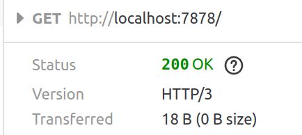

# 2021-01-06
- golangの標準ライブラリでほぼすべてカバーできる思想に惹かれたので、Rustでも標準ライブラリを意識して使うようにしたいと感じた。
- というわけで、Rustでnet/http相当をやってみようとする試み
- https://doc.rust-jp.rs/book-ja/ch20-00-final-project-a-web-server.html
  - マルチスレッドのwebサーバを構築する
- 以下のようにしたらブラウザ側ではHTTP/3になるんだ...(firefox)

```
let response = "HTTP/3 200 OK \r\n\r\n";
```


